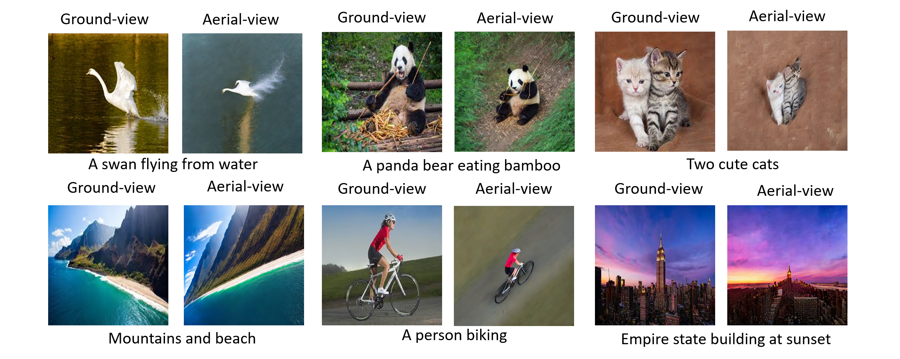
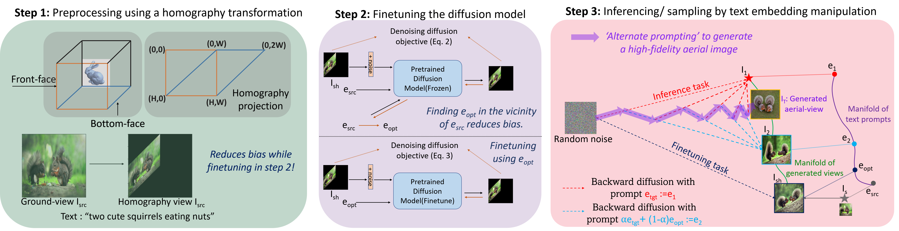

Paper: [**Aerial Diffusion: Text Guided Ground-to-Aerial View Translation from a Single Image using Diffusion Models**](https://arxiv.org/abs/2303.11444)

Please cite our paper if you find it useful. <br>

```
@article{kothandaraman2023aerial, 
  title={Aerial Diffusion: Text Guided Ground-to-Aerial View Translation from a Single Image using Diffusion Models}, 
  author={Kothandaraman, Divya and Zhou, Tianyi and Lin, Ming and Manocha, Dinesh}, 
  journal={arXiv preprint arXiv:2303.11444}, 
  year={2023} 
}
```

<p align="center">

</p>

### Using the code 

Modify the text prompt (line 29) and the path to the ground-view image (line 31) in run_aerialDiffusion.py. <br>

Execute
```
python run_aerialDiffusion.py
```

### Dependencies

torch <br>
cv2 <br>
diffusers <br>
numpy <br>
scipy <br>
accelerate <br>
packaging <br>
transformers <br>

### Method

<p align="center">

</p>

### Acknowledgements

This codebase is heavily borrowed from https://github.com/huggingface/diffusers/blob/main/examples/community/imagic_stable_diffusion.py.
